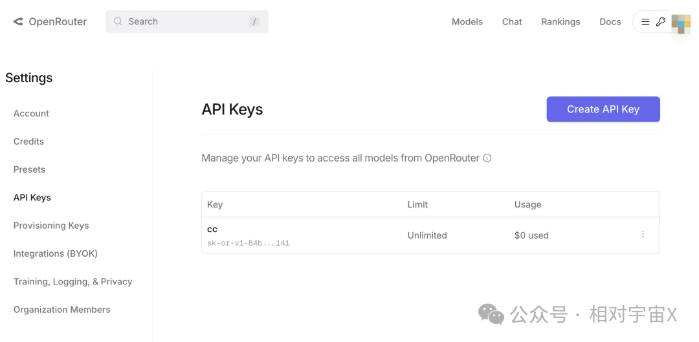

Claude Code 加第三方模型也是能打的，这一点在众多国模上已经验证，而今天要分享的是来自前世界首富马一龙刚放出来的免费使用的 Grok-4-Fast，在大模型供应商 OpenRouter 上提供统一 API 接口，该模型以其 SOTA 成本效率和 2M 令牌上下文窗口著称，支持多模态处理，并通过优化实现高达 98% 的成本降低，每天有一定免费请求额度。本文演示三步搞定部署，通过 Cloudflare Workers 以及 run.claw.cloud，结合 OpenRouter API，让你低成本用 Claude Code 爽翻天。

## 环境准备

注意：本文需要有一定的 Node 知识，纯小白请自行找 AI 学习基础。

### Windows

1. 安装 Node.js：
```powershell
powershell -c "irm https://community.chocolatey.org/install.ps1|iex"
choco install nodejs --version="22.19.0"
```
2. 安装 Claude Code：
```bash
npm install -g @anthropic-ai/claude-code
```

### macOS

1. 安装 Node.js（用 Homebrew：`brew install node` 或从 nodejs.org 下载）：
```bash
brew install node
```
2. 安装 Claude Code：
```bash
npm install -g @anthropic-ai/claude-code
```
## 部署步骤

### 一、部署 new-api 并连接 OpenRouter

1. 访问 [openrouter.ai](https://openrouter.ai)，注册获取免费 API Key。

2. 注册并登录 Claw（[https://console.run.claw.cloud/signin?link=F2TG0ZTMV812](https://console.run.claw.cloud/signin?link=F2TG0ZTMV812)），若用 180 天以上 GitHub 账号可每月领 5 刀额度。进入应用商店搜索 `new-api`，找到后一键部署，等待域名生效。

3. 访问分配的域名（如 `https://your-app.run.claw.cloud`），初次进入需要设置管理员帐号密码，注意帐号长度不能超过 8 位。

4. 渠道管理 → 添加渠道：
   - 名称：随意
   - 类型：OpenAI
   - Base URL：`https://openrouter.ai/api/v1`
   - API Key：你的 OpenRouter API Key
   - 自定义模型：`x-ai/grok-4-fast:free`、`openai/gpt-oss-120b:free`、`cc-medium`、`cc-small`
   - 模型映射：
     - 用“cc-medium”映射 `x-ai/grok-4-fast:free`
     - 用“cc-small”映射 `openai/gpt-oss-120b:free`

5. 令牌管理 → 生成令牌，复制 `sk-xxxxxx`。
### 二、部署 claude-worker-proxy

1. 注册 Cloudflare 并安装 wrangler：[https://developers.cloudflare.com/workers/wrangler](https://developers.cloudflare.com/workers/wrangler)

2. 下载开源项目：
```bash
git clone https://github.com/glidea/claude-worker-proxy
cd claude-worker-proxy
npm install
wrangler login
```

3. 运行：
```bash
npm run deploy
```
记录 Worker 地址：`https://claude-worker-proxy.your-subdomain.workers.dev`。
### 三、配置 Claude Code

1. 编辑 `~/.claude/settings.json`：
```json
{
  "env": {
    "ANTHROPIC_BASE_URL": "https://claude-worker-proxy.your-subdomain.workers.dev/openai/https://your-app.run.claw.cloud/v1",
    "ANTHROPIC_API_KEY": "sk-your-new-api-token",
    "ANTHROPIC_MODEL": "cc-medium",
    "ANTHROPIC_SMALL_FAST_MODEL": "cc-small",
    "API_TIMEOUT_MS": "300000"
  }
}
```

2. 测试链路：
```bash
curl -X POST https://claude-worker-proxy.your-subdomain.workers.dev/v1/messages \
-H "x-api-key: sk-your-token" \
-H "Content-Type: application/json" \
-d '{"model": "cc-medium", "messages": [{"role": "user", "content": "Write a Python hello world"}]}'
```

3. 运行 Claude Code：
```bash
claude
```

搞定！Claude Code 现在用 `x-ai/grok-4-fast:free`，速度高效，成本近零。
## 结语

Claude Code + Grok-4-Fast 是一个不错的组合，充分发挥了马一龙 20 万卡超算中心的澎湃算力，只要将你的问题转成可以用编程解决的问题，可以说 AGI 就是现在！享受这个时代吧 😎